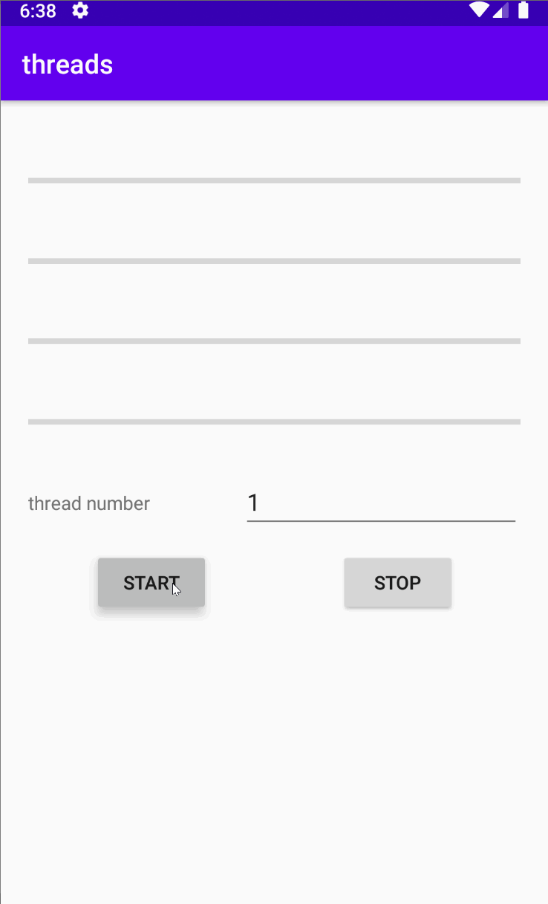
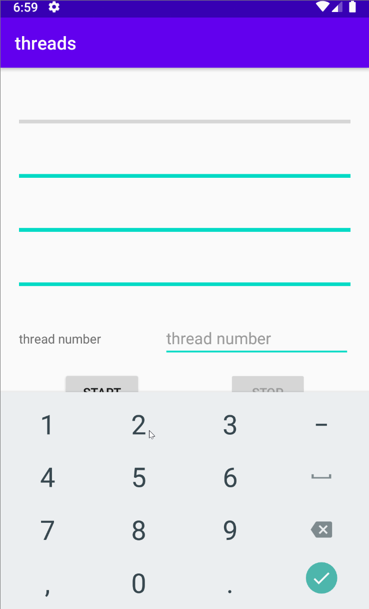
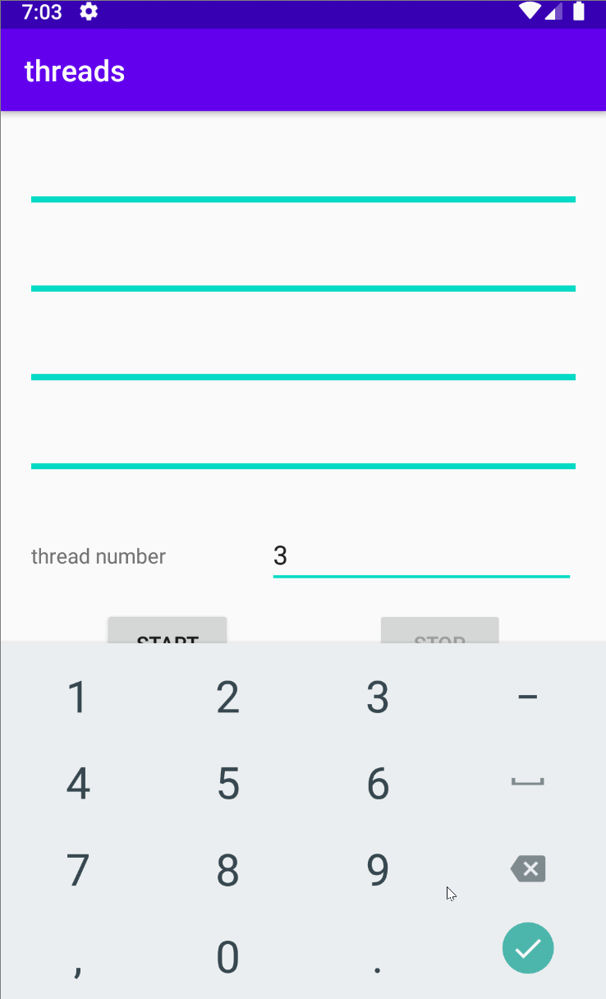
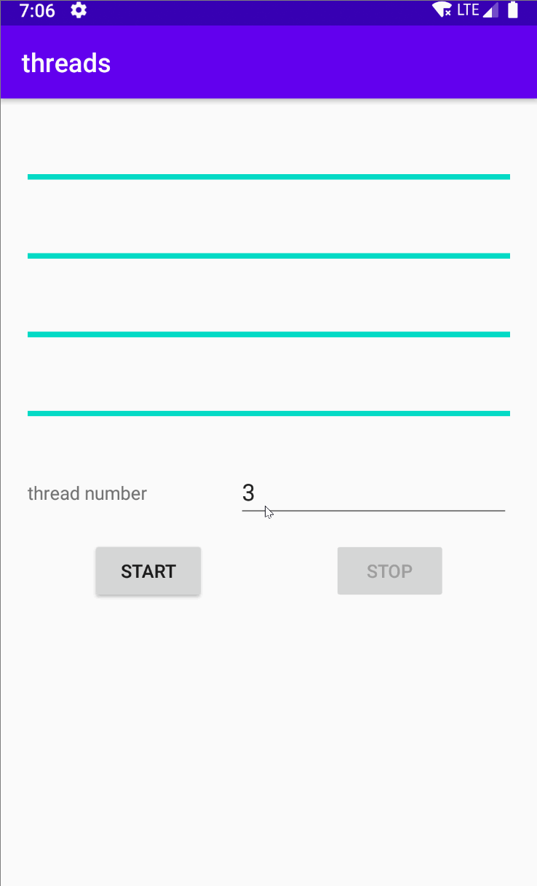

# Android队列、线程池、消息处理、序列化 Demo

用最基本、最简单的demo从原理上讲清楚队列与线程池、消息处理之间是如何的相互协作的。

虽然比较简单，但涵盖的知识点比较多。

为保证线程安全，设定线程之间的通信为可序列化的对象。

## 1 序列化
TaskResult.java

## 2 队列与线程池
队列与线程池是相辅相成的、缺一不可。
ThreadPool.java、TaskThreadPool.java

## 3 Activity与线程之间相互通信
MainActivity.java

## 4 演示动画
按下Start同时请求的4个任务,每个任务更新一个ProgressBar。
### 4.1 1个线程3个队列
因为请求的任务有4个，但队列只有3个，在请求第4个任务时队列已经全部在使用中，因此Activity阻塞，直到3个任务中的任意一个完成后才有响应。同时因为Activity阻塞，因此第一个ProgressBar不会更新。 

### 4.2 2个线程6个队列
一次同时更新两个ProgressBar。其它2个任务在排队，待前面的任务完成后，后面的任务自动运行。 

### 4.3 3个线程9个队列
同2个线程6个队列差不多，区别就是可同时更新3个ProgressBar。 

### 4.4 4个线程12个队列
此时线程数已经和请求的任务数一至，可一次更新完成。 

